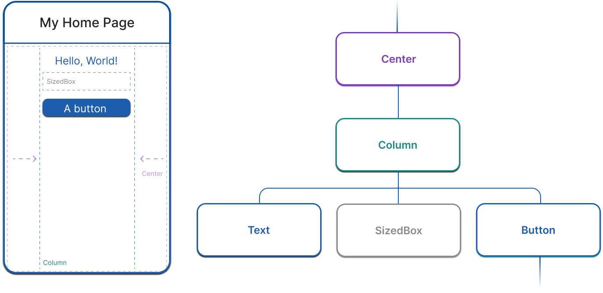

Exemplo de fetch de dados usando Dart


[referencia](https://docs.flutter.dev/get-started/fwe/fundamentals)


```dart

import 'dart:convert';
import 'package:http/http.dart' as http;

class Package {
  final String name, latestVersion;
  String? description;

  Package(this.name, this.latestVersion, this.description);

  @override
  String toString() {
    return 'Package{name: $name, latestVersion: $latestVersion, description: $description}';
  }
}

void main() async {
  final httpPackageUrl = Uri.https('dart.dev', '/f/packages/http.json');
  final httpPackageResponse = await http.get(httpPackageUrl);
  if (httpPackageResponse.statusCode != 200) {
    print('Failed to retrieve the http package!');
    return;
  }
  final json = jsonDecode(httpPackageResponse.body);
  final package = Package(json['name'], json['latestVersion'], json['description']);
  print(package);
}

```

Dart é uma linguagem com type safety, e usa tipagem static para garantir que os tipos de dados sejam consistentes.

O ? é usado para indicar que um valor pode ser nulo.


# Widgets

Widgets são os blocos de construção do flutter apps para interface de usuários, e cada widget is um imutavel declarativo de um elemento da interface de usuário.

widgests são formados a baseados em herarquias e composição, cada widget alinha dentro de outro widget, e cada widget  pode reber context para acessar informações sobre a localização do widget na árvore de widgets.

```dart

import 'package:flutter/material.dart';
import 'package:flutter/services.dart';

void main() => runApp(const MyApp());

class MyApp extends StatelessWidget {
  const MyApp({super.key});

  @override
  Widget build(BuildContext context) {
    return MaterialApp( // Root widget
      home: Scaffold(
        appBar: AppBar(
          title: const Text('My Home Page'),
        ),
        body: Center(
          child: Builder(
            builder: (context) {
              return Column(
                children: [
                  const Text('Hello, World!'),
                  const SizedBox(height: 20),
                  ElevatedButton(
                    onPressed: () {
                      print('Click!');
                    },
                    child: const Text('A button'),
                  ),
                ],
              );
            },
          ),
        ),
      ),
    );
  }
}
```

## Widget Composição

Widgets ssão tipicamente compostos de muitos outros widgets pequienos e de propósito único que se combinam para porduzir efeitos

**widgets de layout :**

seu unico propósito é controla alguns aspecto de layout de outros widget

- Padding
- Alignment
- Row
- Column
- Grid


**Widgets utilitários:**

rcomposto de varios widgets reponsáveis pelo layout,pintura,posicionamentoe dimensionamento

- Container

**Widgets representação visual**

- Text
- ElevatedButton
- Image
- Icon




## Construindo widgets

Para criar uma interface de usuário, você precisa construir Widgets, é preciso adicionar o widget no método build() de um widget.

```dart
class PaddedText extends StatelessWidget {
  const PaddedText({super.key});

  @override
  Widget build(BuildContext context) {
    return Padding(
      padding: const EdgeInsets.all(8.0),
      child: const Text('Hello, World!'),
    );
  }
}

```


O framework chama o métod build quando este widget é criado e quando as dependências do widget mudam.

## Estado do widget

Os widgets podem ser de dois tipos:

- Stateless: não podem ser alterados depois de serem criados
- Stateful: podem ser alterados durante a execução do app

Esses Objetos são subclasses StateFulWidget, eles armazena o estado mutável em uma classe separada que é uma subclasse State. StatefulWidgets , que não possuir o build method,

``` dart

class CounterWidget extends StatefulWidget {
  @override
  State<CounterWidget> createState() => _CounterWidgetState();
}

class _CounterWidgetState extends State<CounterWidget> {
    int _counter = 0;

  void _incrementCounter() {
    setState(() {
      _counter++;
    });
  }

  @override
  Widget build(BuildContext context) {
    return Text('$_counter');
  }
}

```

Separa o estado dos widgets permite que outros widgets tratem widgets sem estado e com estados exatametne da mesma maneira, sem se preocupara em perde o estado.

## Widgets importantes

- Container
- Text
- Scaffold
- AppBar
- Row e Column
- ElevatedButton
- Image
- Icon
