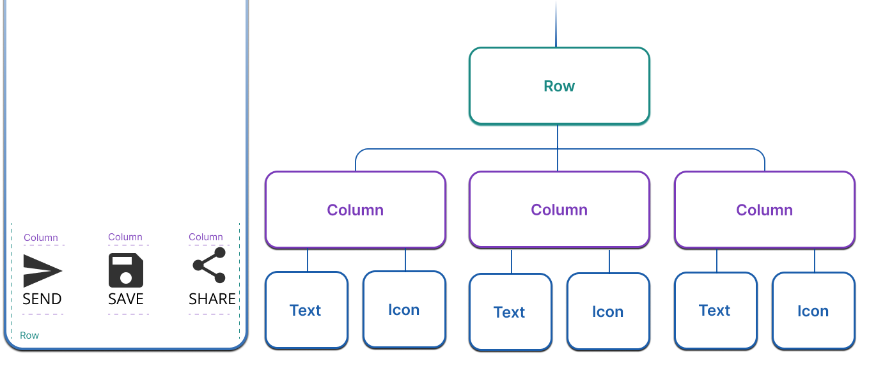
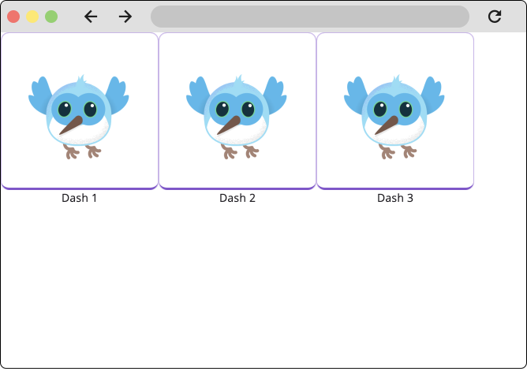
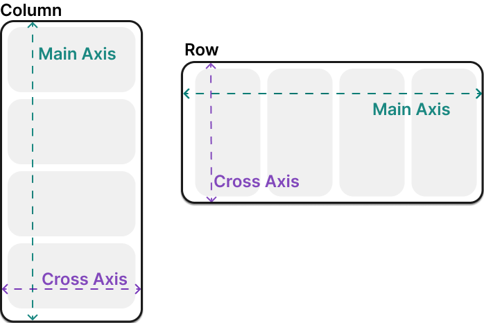
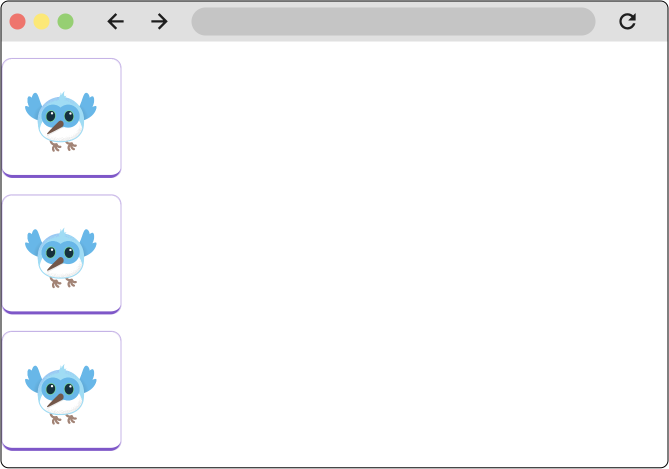
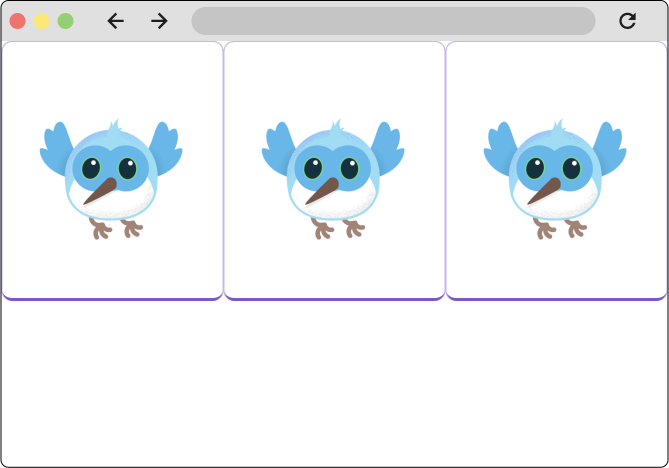
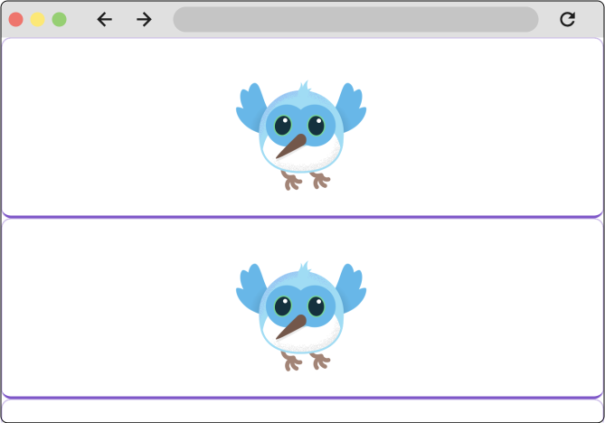
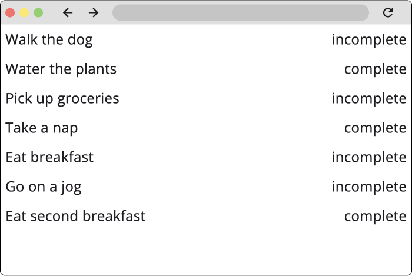
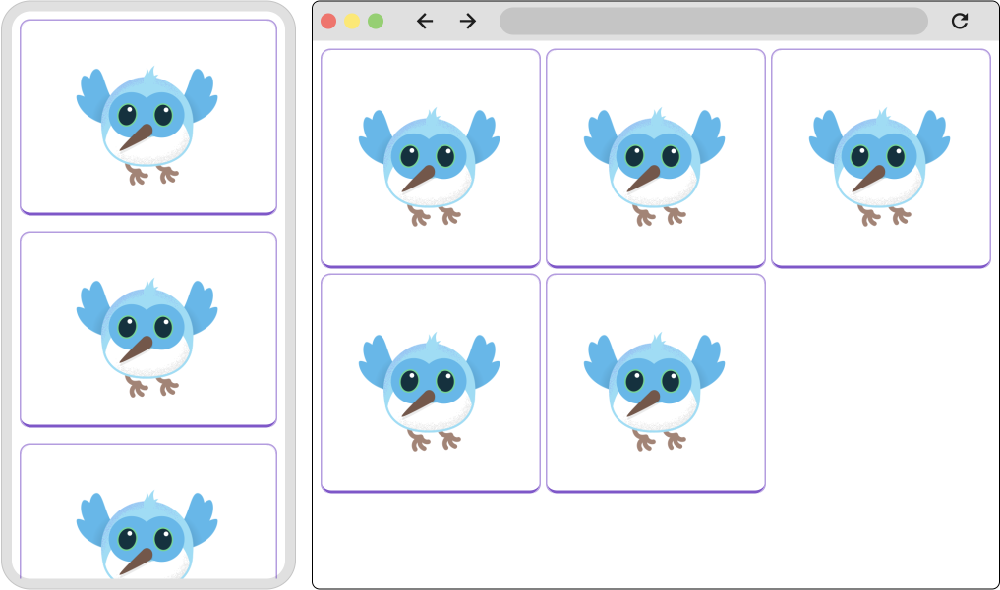
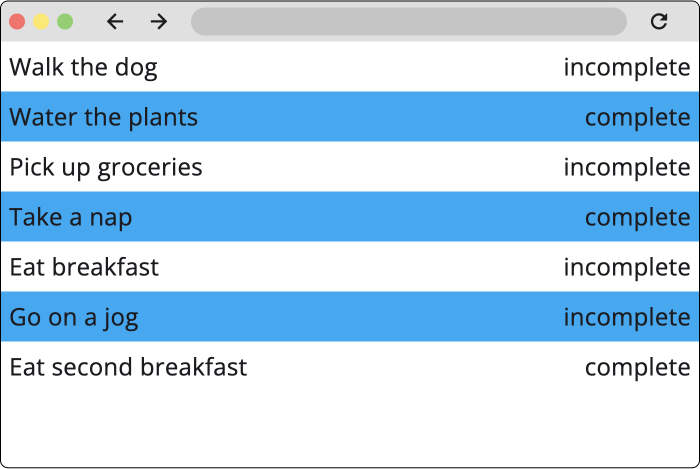

# Compreendendo o layout

No flutter tudo é um widget. Widgets são os blocos de construção de um aplicativo Flutter. Um widget é uma descrição declarativa de uma parte da interface do usuário. Os widgets são compostos e aninhados para construir interfaces complexas..



## Restrições

Layout em um sentido geral refere-se ao tamanho dos widgets e suas posições na tela.

Exemplo

- O widget pai pode impor constraints de tamanho e posição em seus filhos.
-  as constraints são apenas a minimum and maximum width, and a minimum and maximum height.
-  O widget determina qual deve ser seu tamanho dentro dessas restrições e passa sua largura e altura de volta para o pai.
-  O pai olha para o tamanho que ele quer ter e como ele deve ser alinhado, e define a posição do widget de acordo. O alinhamento pode ser definido explicitamente, usando uma variedade de widgets como Center, e as propriedades de alinhamento em Row e Column.


## Box Type

Tipos de box:

- Tentam ser o maior possível, por exemplo Center e ListView
- Tentam ter o mesmo tamanho para cada filho. por exemplo transform e opacity
- tentam ser ter um tamanho particular como imagem e texto

Outros exemplo e o Row e Column que são baseada nas contraints dadas a elas

## Layout a single widget

```dart

Widget build(BuildContext context) {
  return Center(
    child: BorderedImage(),
  );
}

```

Todos os widgets de layout têm um dos seguintes

- Child - propriedade que aceita um único widget, Center,Container, Padding
- children - propriedade que aceita uma lista de widgets, Row,Column, ListView, Stack


## Container

O Container é um conveniente widget que é composto por muitos widgets comuns de layout, layout, painting, positioning, and sizing, Há também o widget Padding que pode ser usado aqui para o mesmo efeito.


é possivel criar complexos no flutter usando a composição de widgets

```dart
Widget build(BuildContext context) {
  return Center(
    Container(
      padding: EdgeInsets.all(16.0),
      child: BorderedImage(),
    ),
  );
}
```
## Layout multiple widgets Vertically or horizontaly


Exemplo de row

```dart

Widget build(BuildContext context) {
  return Row(
    children: [
      BorderedImage(),
      BorderedImage(),
      BorderedImage(),
    ],
  );
}

```

podemos criar interfaces compinadas

``` dart

Widget build(BuildContext context) {
  return Row(
    children: [
      Column(
        children: [
          BorderedImage(),
          Text('Dash 1'),
        ],
      ),
      Column(
        children: [
          BorderedImage(),
          Text('Dash 2'),
        ],
      ),
      Column(
        children: [
          BorderedImage(),
          Text('Dash 3'),
        ],
      ),
    ],
  );
}
```




## Align widgets within rows and columns

Podemos controlar o alinhamento de uma linha ou uma colunas dos filhos utilizando a propriedade mainAxisAlignment e crossAxisAlignment, essas propriedades vão variar dependendo da orientação do objeto




``` dart
Widget build(BuildContext context) {
  return Row(
    mainAxisAlignment: MainAxisAlignment.spaceEvenly,
    children: [
      BorderedImage(),
      BorderedImage(),
      BorderedImage(),
    ],
  );
}
```


As colunas vão funcionar da mesma forma, mas o resultado vai ser diferente, por causa da orientação do widget




## Sizing widgets within rows and columns

Os widgets podem ser dimensionados para caber em uma linha ou coluna usando o Expanded widget.

``` dart
Widget build(BuildContext context) {
  return const Row(
    children: [
      Expanded(
        child: BorderedImage(width: 150, height: 150),
      ),
      Expanded(
        child: BorderedImage(width: 150, height: 150),
      ),
      Expanded(
        child: BorderedImage(width: 150, height: 150),
      ),
    ],
  );
}
```



O Expanded widget também pode editar quanto espaço um widget deve ocupar em relação aos seus irmãos.

``` dart

Widget build(BuildContext context) {
  return const Row(
    children: [
      Expanded(
        child: BorderedImage(width: 150, height: 150),
      ),
      Expanded(
        flex: 2,
        child: BorderedImage(width: 150, height: 150),
      ),
      Expanded(
        child: BorderedImage(width: 150, height: 150),
      ),
    ],
  );
}

```


## Widgets de rolagem

### List Viwer

é um widget do típo coluna que fornece rolagem automaticamente quando seu conteúdo é maior que tela. Diferente de uma collum ou row, o ListView requer que seus filhos ocupem todo o espaço disponível.

``` dart

Widget build(BuildContext context) {
  return ListView(
    children: const [
      BorderedImage(),
      BorderedImage(),
      BorderedImage(),
    ],
  );
}

```



ListViwers são comumente usados quando você tem um número desconhecido ou muito grande de itens de lista. Quando temos uma listam muito grande podemos utilizar o ListView.builder, que constrói apenas os itens que estão visíveis na tela.

``` dart

final List<ToDo> items = Repository.fetchTodos();

Widget build(BuildContext context) {
  return ListView.builder(
    itemCount: items.length,
    itemBuilder: (context, idx) {
      var item = items[idx];
      return Padding(
        padding: const EdgeInsets.all(8.0),
        child: Row(
          mainAxisAlignment: MainAxisAlignment.spaceBetween,
          children: [
            Text(item.description),
            Text(item.isComplete),
          ],
        ),
      );
    },
  );
}

```



## Layouts Adaptáveis

Como o Flutter é usado para criar aplicativos móveis, para tablets, desktops e web, é provável que você precise ajustar seu aplicativo para se comportar de forma diferente dependendo de coisas como tamanho da tela ou dispositivo de entrada.

### Padrão do construtor

widgets que utilizam o padrão builder

- ListView.builder
- GridView.builder
- Builder
- LayoutBuilder
- FutureBuilder


Esses diferentes "construtores" são úteis para resolver problemas diferentes. Por exemplo, o ListView.builder construtor é usado principalmente para renderizar itens preguiçosamente em uma lista, enquanto o Builderwidget é útil para obter acesso ao BuildContext código do widget em profundidade. o LayoutBuilder widget é usado para criar layouts responsivos com base no tamanho da viewport.


 ```dart

 Widget build(BuildContext context) {
  return LayoutBuilder(
    builder: (BuildContext context, BoxConstraints constraints) {
      if (constraints.maxWidth <= 600) {
        return _MobileLayout();
      } else {
        return _DesktopLayout();
      }
    },
  );
}

```



Modificando items especificos

```dart

final List<ToDo> items = Repository.fetchTodos();

Widget build(BuildContext context) {
  return ListView.builder(
    itemCount: items.length,
    itemBuilder: (context, idx) {
      var item = items[idx];
      return Container(
        color: idx % 2 == 0 ? Colors.lightBlue : Colors.transparent,
        padding: const EdgeInsets.all(8.0),
        child: Row(
          mainAxisAlignment: MainAxisAlignment.spaceBetween,
          children: [
            Text(item.description),
            Text(item.isComplete),
          ],
        ),
      );
    },
  );
}

```




## Para definir uma lista horizontal

temos que definir o scrollDirection como Axis.horizontal e o tamanho do container, para adicionar uma coluna em uma lista horizontal, temos que adicionar um widget chamado Expanded

```dart

class FavoritesPage extends StatelessWidget {
  @override
  Widget build(BuildContext context) {
    var appState = context.watch<MyAppState>();

    if (appState.favorites.isEmpty) {
      return Center(
        child: Text('No favorites yet.'),
      );
    }

    return SafeArea(
      child: Column(
        crossAxisAlignment: CrossAxisAlignment.start,
        children: [
          Padding(
            padding: const EdgeInsets.all(8.0),
            child: Text(
              'Favorites',
              style: TextStyle(
                fontSize: 20,
                fontWeight: FontWeight.bold,
              ),
            ),
          ),
          Expanded(
            child: ListView(
              scrollDirection: Axis.horizontal,
              children: [
                for (var pair in appState.favorites)
                  Container(
                    width: 160,
                    child: ListTile(
                      leading: Icon(Icons.favorite),
                      title: Text(pair.asLowerCase),
                    ),
                  )
              ],
            ),
          ),
        ],
      ),
    );
  }
}

 ```
